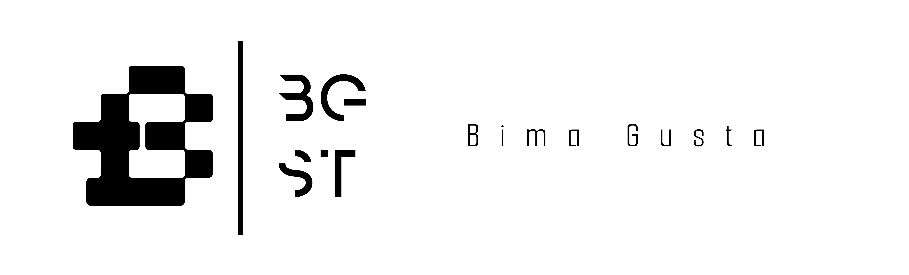

## Hey! 👋

I'm Bima Gusta! 
- <i>Okt 2024 - Now:</i> Bakcend PointsNet Malaysia.
- <i>Apr 2023 - Apr 2024:</i> Backend Paid Internship at [eFishery](https://github.com/eFishery) Bandung. 
- <i>Jun 2022 - Nov 2022:</i> Backend at PT. Manggala Technology Kediri.
- <i>Sep 2018 - Mei 2022:</i> Backend at Multec.TC Kediri.

## 💻 I'm Currently workng on
- Software Engineering (Backend)
- UI in Figma Only (Freelance)

## 👀 Stats

    

    <b><em>GitHub Stats:</em></b> 
          
    <b><em>Programming activity (Last 7 days):</em></b>  
        
         
    <b><em>Top Languages:</em></b>  
        
  

## About Bima ⚡:
I'm a programmer who is used to working from home and comes from Kediri, East Java. 
I believe that I have exceptional skills and expertise in the field of programming and have become accustomed to working independently from home. 
This demonstrates my ability to be self-sufficient and disciplined in managing time and tasks.

## Most Used

    

        
        
    

- Know more about me: [About Bima Gusta](https://iam-bgst.my.id)
- Write to me: [bimagusta61@gmail.com](mailto:bimagusta61@gmail.com)

<h2>📫 How to reach me:</h2>

 
